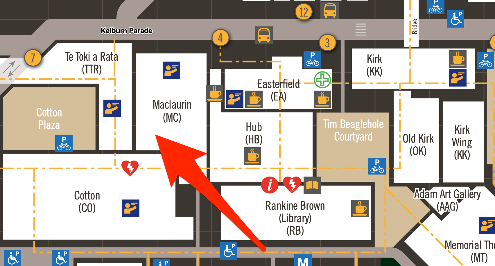

# Welcome!

_You_ are invited to join us at security.ac.nz this August for a
mid-trimester break weekend to learn all about security and hacking.

## Who?

You! Anyone who is learning about software, and wants to learn about
how to make software secure... with a dose of "how to hack" thrown in.

To clarify: The two days will aim to suit students with a 100-level
knowledge of software development. However, you're still welcome if
you're not a University student... anyone interested in security
should come!

## What?

Two days of training in the art of securing the web... covering topics
like:

- Learning to hack
- Capture the Flag
- Bug Bounty
- Threats & Trust
- Secure the Cloud
- Secure Development
- Web Security
- Cyber Security Careers

## Where?

Victoria University of Wellington  
Kelburn Campus  
Wellington

We will be running the two day activities in Maclaurin Lecture Theatre 3 (MC 103) at the Victoria University Kelburn Campus. 

Check out the [campus map](https://www.victoria.ac.nz/about/explore-victoria/campuses/kelburn/kelburn-campus-map.pdf) and look at [bus times](https://www.metlink.org.nz/stop/5915). Parking is limited around the campus, and there are towaway and time restrictions.

If you're unfamiliar with the Kelburn campus, let us know on your registration confirmation form and we'll meet you and show you around.

If you have accessibility requirements, [get in touch](mailto:info@security.ac.nz) and we'll make sure things are sorted.

## When?

Saturday & Sunday  
24 & 25 August  
10am - 6pm

Please arrive before 10am, so we can start promptly.

## How?

[Register now](https://securityacnz.eventbrite.com) for your free ticket to the
best security-themed weekend event at Victoria University this August!

Note: Spaces are limited, and people are notorious for registering and not attending free
events. In the week before the event you'll have to confirm your
registration to keep your place.

## Why?

Over the course of the two days there will be [activities](activities) and [speakers](speakers). You will be learning about all aspects of security from some of the best in New Zealand!

Check out the [handout](handout.pdf) you'll be given on arrival.

## Hungry?

We will be providing a light lunch, catering for vegetarian and gluten free diets. Please bring a water bottle and any snacks you need to keep you going.

The Kelburn campus will be pretty quiet on a mid-term break weekend, so don't count on anywhere being open for coffee or food.

## Share

Print out our [A4 poster](security_ac_nz_poster.png) and display it proudly around your school.

Follow us on twitter: [@securityacnz](https://twitter.com/securityacnz)

Any questions? [info@security.ac.nz](mailto:info@security.ac.nz)

## Boring, but serious stuff

We are committed to running an event that is inclusive to all and
where everyone is welcome. There will be no alcohol.
This event has a [code of conduct](conduct), and we expect everyone to
read it and abide by it. We reserve the right to
remove anyone, for any reason.
